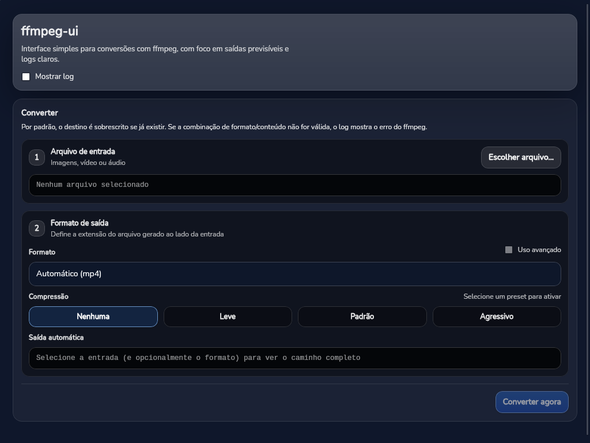

# ffmpeg-desktop

App **Wails** (Go + React/TypeScript) para converter **imagem**, **vídeo** ou **áudio** com o `ffmpeg`.

## Captura de tela



## Pré-requisitos

- **GNU Make** (`make`)
- **Go**, **Node.js** e **npm**
- **Wails** v2 instalado
- **`ffmpeg`** no `PATH`
- Linux:
  - `libwebkit2gtk-4.1-dev` ou `libwebkit2gtk-4.0-dev`
  - `libgtk-3-dev`, `pkg-config`

## Make targets

| Comando | O que faz |
|--------|-----------|
| `make install` | Instala dependências do frontend (`npm install` em `frontend/`) |
| `make generate` | Regenera bindings Wails (`frontend/wailsjs`) após mudar a API Go |
| `make dev` | Modo desenvolvimento (app desktop + hot reload) |
| `make dev-webkit41` | Igual ao `dev`, com WebKitGTK **4.1** (ex.: Ubuntu 25.10+) |
| `make build` | Build de produção (binário em `build/bin/ffmpeg-ui`) |
| `make build-webkit41` | Build de produção com tag `webkit2_41` |
| `make run` | Executa o binário gerado em `build/bin/ffmpeg-ui` |
| `make frontend-dev` | Só o Vite (frontend no browser, sem janela Wails) |
| `make frontend-build` | Só o build estático do frontend |
| `make clean` | Remove `frontend/dist` e `build/bin` |

### Desenvolvimento

```bash
make install
make dev
```

Em distros com WebKitGTK 4.1:

```bash
make install
make dev-webkit41
```

### Build de produção

```bash
make install
make build
make run
```

Com WebKit 4.1:

```bash
make install
make build-webkit41
make run
```

Se o `pkg-config` reclamar de `webkit2gtk-4.0`, instale o pacote WebKit certo para a sua distro e/ou use os alvos `*-webkit41`.
